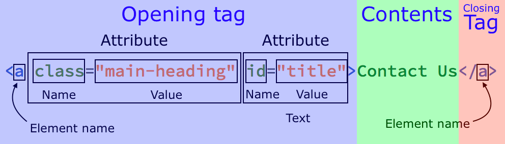

# 1⃣ Lesson 1

## Chuẩn bị

[VSCode](https://code.visualstudio.com/)

## Cú pháp thẻ HTML

<figure><figcaption></figcaption></figure>

VD: `<h1>Quân</h1>`, ``

**Các thẻ HTML**

* Có thẻ mở thì phải có thẻ đóng (trừ một số trường hợp đặc biệt như thẻ `img`, `input`, `br`, ...)
* Các thẻ HTML có thể được đặt lồng vào nhau

```html
<div>
    <h1>Quân</h1>
    <h2>18 tuổi</h2>
</div>
```

**Một số thẻ HTML hay dùng**

* `<h1>` -> `<h6>`: Các thẻ heading, dùng để thể hiện tiêu đề
* `<p>`: Thẻ paragragh, dùng để tạo một đoạn văn bản
* `<div>`: Dùng để đánh dấu một phần trong trang
* `<a>`: Thẻ anchor, dùng để tạo liên kết đến một đường link khác
* ``: Thẻ image, dùng để chèn ảnh vào trang

> **Fact**
>
> * Các thẻ html thường có tên thể hiện ý nghĩa của thẻ đó (tham khảo Semantic HTML). Tuy nhiên điều này là không bắt buộc, đa số trên trang thẻ div thường chiếm nhiều nhất, không biết dùng thẻ gì thì dùng thẻ `<div>`, để nhóm các thẻ lại với nhau đặt vào trong thẻ `<div>`.&#x20;
> * Trừ một số thẻ có chức năng chuyên biệt như thẻ ``, `<input>`, ... là không thể thay thế bằng thẻ khác còn lại sẽ bắt gặp rất nhiều trường hợp trang web thay vì sử dụng cái thẻ như `<header>` để đánh dấu phần header, `<footer>` để đánh dấu phần footer thì sẽ sử dụng thẻ `<div>` (đi kèm với `id` hoặc `class`) cho các trường hợp trên

## Cú pháp comment code HTML

```html
<!-- Single line -->
<!-- <div>Single line comment</div> -->

<!-- Multiple lines -->
<!-- <div>
    <p>Multiple lines comment</p>
</div> -->
```

## Cú pháp CSS cơ bản

### Thêm CSS vào file HTML

Có thể thể thêm CSS vào file 3 cách:

* **Inline style**: viết style trực tiếp bên trong attribute `style` của thẻ (cách này cực kì hạn chế dùng, vì style như này làm cho code HTML rất rối, và bị hạn chế nhiều chức năng)
* **Internal**: viết style trong thẻ `<style>` trong trang HTML (cách này cũng hạn chế dùng)
* **External**: viết style trong file CSS và thêm vào trang HTML thông qua thẻ **\<link>**

### Cú pháp selector cơ bản

```css
/* Chọn element theo tên thẻ */
/* tag-name */
p {}
div {}
a {}
h1, h2 {}
```

### Một số thuộc tính cơ bản

```css
div {
    /* Màu chữ */
    color: #000000;

    /* Màu nền */
    background-color: #ffffff;

    /* Kích thước */
    width: 100px;
    height: 100px;

    /* Cỡ chữ */
    font-size: 12px;

    /* Hình nền */
    background-image: url("http://example.com/image.png");

    /* Căn lề chữ */
    text-align: center;
}
```
