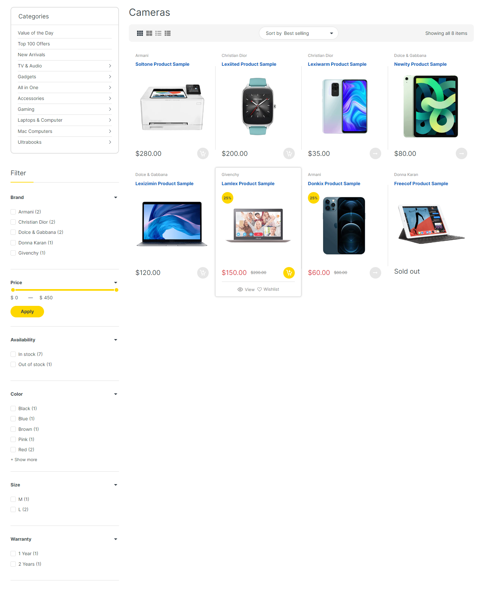

# 1⃣ Checkpoint 1

## **Tạo một danh sách sản phẩm đáp ứng các yêu cầu sau:**

* Danh sách sản phẩm được render bằng Javascript
* Có 1 ô select dùng để sắp xếp sản phầm theo giá (tăng|giảm), theo tên (tăng|giảm)
* Có 1 ô select dùng để lọc sản phẩm theo thể loại

> Điểm cộng (optional thôi không bắt buộc nhưng làm được thì thêm điểm):
>
> * Lưu danh sách sản phẩm trong LocalStorage
> * Danh sách sản phẩm lấy từ API về
> * Trang web có style đẹp, rõ ràng, dễ nhìn

## **Tham khảo:**

****[**https://electrox.arenacommerce.com/collections/cameras**](https://electrox.arenacommerce.com/collections/cameras)****

<figure><figcaption>
UI tham khảo
</figcaption></figure>

## Link nộp bài:

> Lưu ý nộp đúng folder lớp của mình:

### NPS - JSI08 (Sáng CN 9 - 11h):

Nộp link Github chứa code bài làm vào sheet sau: [https://docs.google.com/spreadsheets/d/1sD0Bnpj8tBtHHSD04316hYnxPr8u3kmFezCcRwkx5QU/edit?usp=sharing](https://docs.google.com/spreadsheets/d/1sD0Bnpj8tBtHHSD04316hYnxPr8u3kmFezCcRwkx5QU/edit?usp=sharing)
